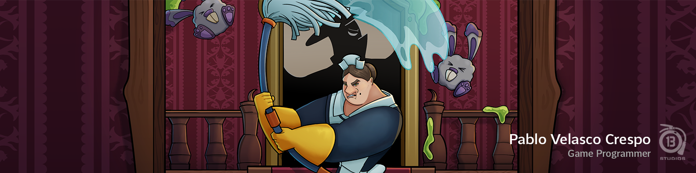

# 👋 Hi, I'm Pablo Velasco Crespo  

🎮 **Game Programmer | Software Engineer | Unreal Engine & Unity Developer**  
Passionate about building scalable, efficient, and fun game systems.  

---

## 🧑‍💻 About Me  
- 💻 **Tech Stack:** C++, C#, Lua, Unreal Engine 5, Unity  
- 🧩 **Specialties:** System Architecture, Gameplay Programming, Procedural Generation, CPU/GPU Optimization  
- 📚 Always learning and experimenting with new tools, frameworks, and techniques.  
- 🤝 Strong believer in clean code, maintainable architecture, and collaborative development.  
- 🫧 Currently working in [Dorothy's Job](https://store.steampowered.com/app/3926730/Dorothys_Job/)

---

## 🚀 Featured Projects  
- 🏗 **Procedural Level Generator** – Custom graph-based system for Unreal Engine 5  
- 🎯 **Gameplay Systems** – Weapons, interactables, game flow, and world management  
- 🔄 **Engine Migration** – Ported a full game from GameMaker to Unity (Akura Games)  

> 📌 *You can explore my repositories below to see code samples, prototypes, and personal projects.*  

---

## 🧠 Skills

 

 

 

 
 

---

## 📚 Education  
🎓 **Master’s Degree in Game Programming** – U-TAD (2024 - 2025)  
🎓 **Bachelor’s in Software Engineering** – UCLM (2018 - 2022)  

---

## 🏆 Achievements  
- 📝 **Publication:** [Conversion of the Spanish WordNet databases into a Prolog-readable format](https://www.researchgate.net/publication/383279002_Conversion_of_the_Spanish_WordNet_databases_into_a_Prolog-readable_format)  
- 🧠 Research project on NLP and semantic analysis (UCLM, 2022-2024)  

---

## 📫 Connect with Me  
  
  

---

✨ *"Clean code is not just about making things work – it's about making things last."*  
